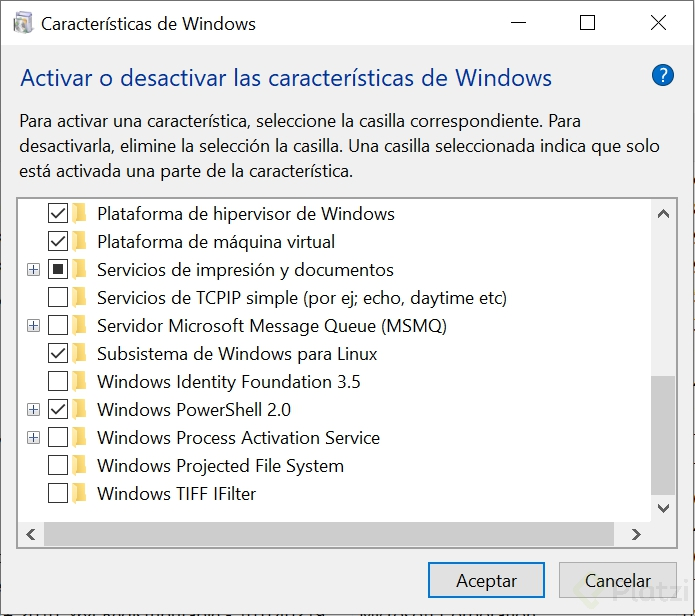

# Notes about Docker

This is a compilation of notes, files, etc about this superb course by gvilarino on Platzi
https://github.com/platzi/docker

### Problems when building:

- Development dependencies (packages)
- Runtime versions
- Equivalence of development environments (code sharing)
- Equivalence of production environments (go to production)
- Versions / compatibility(integration of other services e.g.: databases) that run in speficic OS for example
  - En mi maquina tengo una version de python, version del codigo, dependencias y que todo eso se parezca al entorno de produccion.

### Problems when distributing:

- Different build generations (Artefacts jars, binaries, apks)
- Access to production servers
- Native vs. distributed execution
- Serverless

### Problems when executing:

- Application dependencies
- Operating System Compatibility
- Availability of external services
- Hardware Resources

### Docker allows:

- "Build, distribute and run your code anywhere without worrying"
- "Docker comes to improve the previews concepts of VMS"

---

### Virtualizacion

Permite atacar en simultáneo los tres problemas del desarrollo de software profesional.

### Problemas de la virtualizacion

- PESO: En el orden de los GBs. Repiten archivos en común. Inicio lento.
- COSTO DE ADMINISTRACION: Necesita mantenimiento igual que cualquier otra computadora (actualizaciones)
- MULTIPLES DE FORMATO: VDI, VMDK, VHD, raw, etc

##### Containerización

El empleo de contenedores para construir y desplegar software.

- Flexibles
- Livianos --> reutilizan el kernel, y del sistema OS
- Portables --> corren de la misma manera en cualquier maquina
- Bajo acoplamiento --> un contenedor tiene todo lo que necesita para correr
- Escalables --> Es facil crear replicas, facil y rapido.
- Seguros --> EL contenedor se asegura que sea impermeable

### Virtualizacion vs Containerización

- `Virtualización`: A diferencia de un contenedor, las máquinas virtuales ejecutan un sistema operativo completo, incluido su propio kernel.

- `Containerización`:Un contenedor es un silo aislado y ligero para ejecutar una aplicación en el sistema operativo host. Los contenedores se basan en el kernel del sistema operativo host (que puede considerarse la fontanería del sistema operativo), y solo puede contener aplicaciones y algunas API ligeras del sistema operativo y servicios que se ejecutan en modo de usuario.

## Installing Docker in windows

Trabajar con Docker desde Windows 10 es posible solo que si lleva su tiempo configurar el entorno, No necesitas tener Windows 10 pro en mi caso uso windows 10 home y todo va bien:

Activa estas casillas de Hypervisor, Maquina Virtual y Subystem for Linux


Sigue este tutorial y utiliza wsl2 la nueva versión mejorada lanzada en 2020 WSL2
https://docs.microsoft.com/en-us/windows/wsl/install-win10

Instala Docker Desktop , te dara un breve tutorial y te pedira cerrar sesión al terminar
https://www.docker.com/products/docker-desktop
https://docs.docker.com/docker-for-windows/wsl/

Prueba los comandos de docker desde la terminal de wsl2

### What's docker, how it works?

Platform to build, execute and share applications with containers.


Componentes DENTRO del circulo de Docker:

1. `Docker daemon`: Es el centro de docker, el corazón que gracias a el, podemos comunicarnos con los servicios de docker. El que interactua con el OS.
2. `REST API`: Como cualquier otra API, es la que nos permite visualizar docker de forma “gráfica”.
3. `Cliente de docker (docker CLI)`: Gracias a este componente, podemos comunicarnos con el corazón de docker (Docker Daemon) que por defecto es la línea de comandos.

Dentro de la arquitectura de Docker encontramos:

1. `Contenedores`: Es la razón de ser de Docker, es donde podemos encapsular nuestras imagenes para llevarlas a otra computadora, o servidor, etc.
2. `Imagenes`: Son las encapsulaciones de x contenedor. Podemos correr nuestra aplicación en Java por medio de una imagen, podemos utilizar Ubuntu para correr nuestro proyecto, etc.
3. `Volumenes de datos`: Podemos acceder con seguridad al sistema de archivos de nuestra máquina.
4. `Redes (network)`: Son las que permiten la comunicación entre contenedores.

## Containers

- It is where our applications will run.

- Es una agrupación de procesos que corren nativamente en la maquina.

- Es una entidad lógica, no tiene el limite estricto de las máquinas virtuales, emulación del sistema operativo simulado por otra más abajo.

- Ejecuta sus procesos de forma nativa.

- Los procesos que se ejecutan adentro de los contenedores ven su universo como el contenedor lo define, no pueden ver mas allá del contenedor, a pesar de estar corriendo en una maquina más grande.

- No tienen forma de consumir más recursos que los que se les permite. Si esta restringido en memoria ram por ejemplo, es la única que pueden usar.

- A fines prácticos los podemos imaginar cómo maquinas virtuales, pero NO lo son. Máquinas virtuales livianas.

- Docker corre de forma nativa solo en Linux.

- Sector del disco: Cuando un contenedor es ejecutado, el daemon de docker le dice, a partir de acá para arriba este disco es tuyo, pero no puedes subir mas arriba.

- Docker hace que los procesos adentro de un contenedor este aislados del resto del sistema, no le permite ver más allá.

- Cada contenedor tiene un ID único, también tiene un nombre.

setting contraints in Docker --> https://docs.docker.com/engine/reference/run/#runtime-constraints-on-resources

## Estado de Docker (docker ps -a) --> Exited, Up, etc.

- `docker run hello-world` (corro el contenedor hello-world)
- `docker ps` (muestra los contenedores activos)
- `docker ps -a` (muestra todos los contenedores)
- `docker inspect <containe ID>` (muestra el detalle completo de un contenedor)
- `docker inspect <name>` (igual que el anterior pero invocado con el nombre)
- `docker run –-name hello-platzi hello-world` (le asigno un nombre custom “hello-platzi”)
- `docker rename hello-platzi hola-platzy` (cambio el nombre de hello-platzi a hola-platzi)
- `docker rm <ID o nombre>` (borro un contenedor)
- `docker container prune` (borro todos lo contenedores que esten parados)

## Run a Linux VM

- `docker run ubuntu` (corre un ubuntu pero lo deja apagado)
- `docker ps -a` (lista todos los contenedores)
- `docker run -it ubuntu` (lo corre y entro al shell de ubuntu)
  -i: interactivo
  -t: abre la consola

- `docker run --name [nameContainer] -dit ubuntu`
  **-d flag significa detached**

<h1>cat /etc/lsb-release (veo la versión de Linux)</h1> inside the cmd to check the ubuntu version

## Lifecycle of a container

Cada vez que un contendor se ejecuta, en realidad lo que ejecuta es un proceso del sistema operativo. Este proceso se le conoce como `Main process`.

`Main process`
Determina la vida del contenedor, un contendor corre siempre y cuando su proceso principal este corriendo.

`Sub process`
Un contenedor puede tener o lanzar procesos alternos al main process, si estos fallan el contenedor va a seguir encedido a menos que falle el main.

Ejemplos manejados en el video

Batch como Main process
`Agujero negro (/dev/null) como Main process`

- `docker ps -a` (veo todos los contenedores)
- `docker run --name <nombre> -d ubuntu -f <comando>` (si se envia el comando, hace un override del comando)
- `docker run --name alwaysup -d ubuntu tail -f /dev/null` (mantiene el contenedor activo)
- `docker exec -it alwaysup bash` (entro al contenedor pero no estoy en el proceso principal)
- `docker inspect --format ‘{{.State.Pid}}’ alwaysup` (veo el main process del ubuntu)

desde Linux si ejecuto kill -9 <PID> mata el proceso dentro del contenedor de ubuntu pero desde MAC no funciona)

## Exposing a container (ports -p 8080:80)

Cada contenedor tiene su `stack de networking` e `interfaz de red virtual`

- `docker run -d --name proxy nginx` (corro un nginx)
  - Por default el esta escuchando en 80/TCP
  - ese 80 es el puerto interno del contenedor, no de la computadora de uno
- `docker stop proxy` (apaga el contenedor)
- `docker rm proxy` (borro el contenedor)
- `docker rm -f` <contenedor> (lo para y lo borra)
- `docker run -d --name proxy -p 8080:80 nginx` (corro un nginx y expongo el puerto 80 del contenedor en el puerto 8080 de mi máquina)

** p es de publish aunque mucha gente dice que es de ports **
-p <Puerto_en_maquina_anfitriona>:<Puerto_interno>
`localhost:8080` (desde mi navegador compruebo que funcione)

- `docker logs proxy` (veo los logs)
- `docker logs -f proxy` (hago un follow del log)
- `docker logs --tail 10 -f proxy` (veo y sigo solo las 10 últimas entradas del log)

## Bind mounts (-v)

Necesita Que directorio voy a montar
Basicamente lo que hace es atar una ruta dentro la mquina del contenedor con el contenedor,
es practico porque permite compartir cambios both ways.

- `mkdir dockerdata` (creo un directorio en mi máquina)
- `docker run -d --name db mongo`
- `docker ps` (veo los contenedores activos)
- `docker exec -it db bash` (entro al bash del contenedor)
- `mongo` (me conecto a la BBDD)

- `show dbs` (listo las BBDD)
- `use platzi` ( creo la BBDD platzi)
- `db.users.insert({“nombre”:“gabriel”})` (inserto un nuevo dato)
- `db.users.find()` (veo el dato que cargué)
  QUiero hacer una copia para que lo que este en mi maquina este en el contenedor
- `docker run -d --name db -v <path de mi maquina>:<path dentro del contenedor(/data/db mongo)> mongo` (corro un contenedor de mongo y creo un bind mount)

Ahora que hay un Bind Mount ejecuto de nuevo

- `docker ps`
- `docker exec -it db bash` (entro al bash del contenedor)
- `mongo` (me conecto a la BBDD)

- `show dbs` (listo las BBDD)
- `use platzi` ( creo la BBDD platzi)
- `db.users.insert({"nombre":"gabriel"})` (inserto un nuevo dato)
- `db.users.find()` (veo el dato que cargué)

## Volumenes (--mount src=NAME,dst=/data/db)

Es una evolucion de bind mounts para evitar problemas de seguridad
Si no existe lo crea por nosotros!

- `docker volume ls` (listo los volumes)
- `docker volume create dbdata` (creo un volume)
- `docker run -d --name db --mount src=dbdata,dst=/data/db mongo` (corro la BBDD y monto el volume)
- `docker inspect db` (veo la información detallada del contenedor)
- `mongo` (me conecto a la BBDD)

- `show dbs` (listo las BBDD)
- `use platzi` ( creo la BBDD platzi)
- `db.users.insert({"nombre":"Gabriel"})` (inserto un nuevo dato)
- `db.users.find()` (veo el dato que cargué)

Bind mount and volumes
When we use a container the data generated is deleted when the container is stopped or removed, so how we can save the data, there are two ways to do it bind mount and volumes.

**Bind mount** helps us to bind a directory in our machine to a directory in a container. This allows saving data in our directory and use the same data each time we use the container.

But it can be dangerous because we are allowing the container to have access to one spot in our machine and if the container is malicious it can use in a bad way whatever info we had in that directory.

**Volumes** are the evolution of the bind mount. Volumes solve the problems of security and privacy that were found in bind mounts. How does it work? The disc part we share with docker is completely managed by docker, and we don’t have access unless we have privileges, but it is very convenient because we have only one place where our docker’s data is stored, and only docker can perform modifications on it.

## Extract/insert files from/in a container (docker cp)

**Host**: Donde Docker esta instalado.
**Bind Mount**: Guarda los archivos en la maquina local persistiendo y visualizando estos datos (No seguro). Para pruebas rapidas
**Volume**: Guarda los archivos en el area de Docker donde Docker los administra (Seguro). Para compartir datos entre contenedores
**TMPFS Mount**: Guarda los archivos temporalmente y persiste los datos en la memoria del contenedor, cuando muera sus datos mueren con el contenedor. (temporary file system mount)

- `touch prueba.txt` (creo un archivo en mi máquina)
- `docker run -d --name copytest ubuntu tail -f /dev/null` (corro un ubuntu y le agrego el tail para que quede activo)
- `docker exec -it copytest bash` (entro al contenedor)
- `mkdir testing` (creo un directorio en el contenedor)
- `docker cp prueba.txt copytest:/testing/test.txt` (copio el archivo dentro del contenedor)
- `docker exec -it copytest bash` (entro al contenedor)

- `docker cp copytest:/testing localtesting` (copio el directorio de un contenedor a mi máquina)
  con “docker cp” no hace falta que el contenedor esté corriendo

## Images --> The way docker let us build new containers or the way we could share them

Contenedores solucionan la ejecucion. (objeto en OOP)
Imagenes solucionan la construccion y distribucion (clase en OOP)

- `docker image ls` (veo las imágenes que tengo localmente)
- `docker pull ubuntu:20.04` (bajo la imagen de ubuntu con una versión específica)
- `docker pull [imageName]`
- `docker pull [imageName]:[versionImage]`
- `docker image prune -a` (to delete all images)

¿Qué son las imágenes?
Son moldes o plantillas que tienen empaquetado todo lo necesario para funcionar. Docker usa estás misma para construir contenedores.

¿Para qué sirven las imágenes en la construcción de software?
Las imágenes sirven para crear contenedores y también es como docker intenta solucionar el problema de construcción de y distribución de software.

Listar imágenes locales de docker. Esta instrucción de terminal mostrará las siguientes columnas

- `TAG`: Es la version de la imagen, cuando no especificamos que versión de descargar docker asume que es la última
- `CREATE AT`: tiempo de creación
- `SIZE`: Tamaño de la imagen
- `IMAGE ID`: Este es el identificador de la imagen. Si descargamos dos imágenes que son iguales al realizar un pull, docker lo que hará es tener un puntero lógico a la misma imagen ya descargada y no descargará la otra imagen. Existe la posibilidad que tenga TAG diferentes, pero serán la misma imagen. Esto último se puede comprobar viendo el IMAGE ID, debería ser los mismos.

## How to create images (the images are inmmutable)

This concept makes it easy to rely on when transfering them.

Dockerfile describe lo que yo le pase para crear una imagen.
Imagen, plantilla para crear contenedores

It will always be based in a file called DockerFile

- `mkdir imagenes` (creo un directorio en mi máquina)
- `cd imagenes` (entro al directorio)
- `touch Dockerfile` (creo un Dockerfile)
- `code .` (abro code en el direcotrio en el que estoy)

**Contenido del Dockerfile**
FROM ubuntu:latest (siempre lo lleva y dce que esta basado en algo mas)
RUN touch /usr/src/hola-mundo.txt (comando a ejecutar en tiempo de build)
##fin##

- `docker build -t ubuntu:platzi .` (creo una imagen con el contexto de build <directorio>) -t --> tag, . es el contexto de build, osea a que parte del disco tiene acceso el proceso build mientras se este ejecutando.
- `docker image ls` (should list the created image)
- `docker run -it ubuntu:platzi` (corro el contenedor con la nueva imagen)
- `docker login` (me logueo en docker hub)
- `docker tag ubuntu:platzi miusuario/ubuntu:platzi` (cambio el tag para poder subirla a mi docker hub)
- `docker push miusuario/ubuntu:platzi` (publico la imagen a mi docker hub)

## Layer System

Las imágenes son un conjunto de capas, y a partir del Dockerfile se puede saber como está construido una imagen. Existen distintas maneras de ver las capas que conforman una imagen:

1. Si la imagen es pública se puede visitar Dockerhub y buscar una imagen para ver su Dockerfile. Una vez encontrar la imagen buscamos en los tag y haciendo clic en los tag se mostrará el docker file para construir dicha imagen.

2. Se puede hacer a través de la línea, esta opción no es muy cómoda. Es importante destaca que los cambios se presenta por filas y las filas más inferiores son los cambios más viejos y las que están más arriba son los cambios más recientes. el comando es:

- `sudo docker history <nombre imagen: nombre tag>`
- `sudo docker history ubuntu:platzi`
- `docker history ubuntu:platzi` (veo la info de como se construyó cada capa)
- `dive ubuntu:platzi` (veo la info de la imagen con el programa dive)

Otra opción es una herramienta de terminal creada por un usuario llamada dive https://github.com/wagoodman/dive, al ejecutar esta herramienta se puede visualizar que del lado izquierdo las capas que tiene la imagen y del lado derecho se visualiza el detalle de cambios que genera cada capa. el comando es el siguiente:
$ sudo dive <nombre de imagen:nombre tag>
Ejemplo:
$ sudo dive ubuntu:platzi

Los cambios que se muestran en la terminal son de la siguiente forma, los más antiguos abajo y los más recientes arriba

En la construcción de una imagen Es importante tomar en cuenta lo siguiente:

En la construcción de una imagen, se puede optar por instalar paquetes o crear archivos en una capa y luego desinstalar los paquetes o eliminar los archivos en otra capa. Esto es poco óptimo porque las capas son inmutables y en este caso estaríamos desperdiciando espacios. El motivo de que las capas son inmutables es para que al momento de crear una imagen docker no agrega capas ya creadas.

Una estrategia para evitar desperdiciar espacio es que en la misma capa se cree o instalen los paquetes y luego de terminar la operación que esto realizan se desinstale o eliminen.

Otra estrategia de optimizar es que una vez creado el creada la imagen todas las operaciones se hagan desde un contenedor.

## Developing with Docker

The base project is a platzi project

- `git clone https://github.com/platzi/docker`
- `docker build -t platziapp .` (creo la imagen local)
- `docker image ls` (listo las imagenes locales)
- `docker run --rm -p 3000:3000 platziapp` (creo el contenedor y cuando se detenga se borra, lo publica el puerto 3000)
- `docker ps` (veo los contenedores activos)

## Taking advantage of the cache

Considera cada una de las layers cada vez que crea una nueva para intentar ahorrar tiempo y espacio haciendo punteros.

- `docker build -t platziapp .` (creo la imagen local)
- `docker run --rm -p 3000:3000 -v pathlocal/index.js:pathcontenedor/index.js platziapp` (corro un contenedor y monto el archivo index.js para que se actualice dinámicamente con nodemon que está declarado en mi Dockerfile)

Better solution

```shell
  FROM node:current
  WORKDIR /usr/app/server
  COPY ["package.json", "package-lock.json", "."]
  RUN npm install
  COPY [".", "."]
  RUN npm run build
  COPY [".env", "./build"]
  EXPOSE 3000
  CMD node src/index.js
```

Best solution to avoid building a new image

```shell
  FROM node:12
  #We do this to install all the dependencies within the image
  COPY ["package.json" , "package-lock.json", "/usr/src/"]
  WORKDIR /usr/src
  RUN npm install
  #if this operation means to override files, it will override only the newer ones
  COPY [".", "/usr/src/"]
  EXPOSE 3000
  CMD ["npx", "nodemon", "index.js"]
```

Las imagenes nunca deben tener archivos .env esto es porque en las variables de entorno normalmente se meten datos sensibles, y si los agregas a la imagen cualquier persona podra verlos, la mejor forma de mandarle las variables de entorno es al momento del run

`docker run --env-file ./.env image`

## How to colaborate between containers (networking)

We communicate containers with networks

El networking de Docker es prácticamente como crear un localhost virtual y conectar ahí todas las máquinas que quieras, es como si la red fuese un router virtual y conectas cada máquina virtual a ese router virtual y entonces cada máquina puede acceder a un localhost virtual jaja, es una LAN party de máquinas virtuales! xD

- `docker network ls` (listo las redes)
- `docker network create --atachable plazinet` (creo la red) el attachable significa que se pueden conecta a ella.
- `docker network inspect plazinet` (veo toda la definición de la red creada)
- `docker run -d --name db mongo` (creo el contenedor de la BBDD)
- `docker network connect plazinet db` (conecto el contenedor “db” a la red “platzinet”)
- `docker network inspect plazinet` (veo toda la definición de la red creada)
- `docker run -d -name app -p 3000:3000 --env MONGO_URL=mondodb://db:27017/test platziapp` (corro el contenedor “app” y le paso una variable)
- `docker network connect plazinet app` (conecto el contenedor “app” a la red “plazinet”)

Los tipos de redes son:

- Host --> representacion real de la red de mi maquina
- Bridge.
- None. --> si queremos que no tenga networking
- Overlay.
- Macvlan.
  En caso de requerir mas información los invito a la siguiente URL https://docs.docker.com/network/ para que conozcan más al detalle acerca de estas redes que abren nuevos pasos en el mundo de docker.

# Docker-compose (the tool all in one!)

- Let us describe in a declarative way the architecture of the services we need to interact

- `docker-compose up -d` (crea todo lo declarado en el archivo docker-compose.yml)

- version --> which features are supported

```docker
# Versión del compose file
version: "3.8"

# Servicios que componen nuestra aplicación.
## Un servicio puede estar compuesto por uno o más contenedores, distintos componentes que componen la aplicacion para ejecutarse correctamente
services:
# nombre del servicio.
  app:
  # Imagen a utilizar.
    image: platziapp
	# Declaración de variables de entorno.
    environment:
      MONGO_URL: "mongodb://db:27017/test"
	# Indica que este servicio depende de otro, en este caso DB.
	# El servicio app solo iniciara si el servicio debe inicia correctamente.
    depends_on:
      - db
	# Puerto del contenedor expuesto.
    ports:
      - "3000:3000"

  db:
    image: mongo
```

- `docker network ls` (listo las redes)
- `docker network inspect docker_default` (veo la definición de la red)
- `docker-compose logs` (veo todos los logs)
- `docker-compose logs app` (solo veo el log de “app”)
- `docker-compose logs -f app` (hago un follow del log de app)
- `docker-compose exec app bash` (entro al shell del contenedor app) donde app es el servicio, no se debe poner el -it, no hace falta
- `docker-compose ps` (veo los contenedores generados por docker compose)
- `docker-compose down` (borro todo lo generado por docker compose)

- No hay que asignar nombres a los contenedores, docker-compose lo hace automaticamente,
- Aun asi uno puede cominarse con ellos.
- Dif entre servicio y contenedor: Un servicio puede contener uno o mas contenedores de la misma imagen.
- We don't define a network, it is set for us!

## Docker-compose as a dev tool.

We replace the `image:name` for `build: .` where `.` is the context.

```Dockerfile
version: "3.8"

services:
  app:
	# crea una imagen con los ficheros del directorio actual.
    build: .
    environment:
      MONGO_URL: "mongodb://db:27017/test"
    depends_on:
      - db
    ports:
      - "3000:3000"
	# Sección para definir los bindmount.
    volumes:
			#<local path>:<container path> # el directorio "<.>" actual   se montará en "/usr/src" en el contenedor.
      - .:/usr/src
			# indica que ficheros debe ignorar
      - /usr/src/node_modules
	# Permite pasarle un comando a ejecutar al servicio app.
    command: npx nodemon  index.js

  db:
    image: mongo
```

```shell
docker-compose build  #" hace un build de los servicios en el directorio actual".
					 						## El nombre de la imagen suele ser <path>_<Service name>:latest
docker-compose build <service name> #" Vuelve a crear la imagen del servicio app"
docker-compose up -d # inicia los servicios, y crea una imagen nueva en caso de que detecte cambios
```

- `docker-compose build` (crea las imágenes)
- `docker-compose up -d` (crea los servicios/contenedores)
- `docker-compose logs app` (veo los logs de “app”)
- `docker-compose logs -f app` (hago un follow de los logs de “app”)
- `docker-compose build app` (just builds the app service)

If the container is running you don't need to do docker-compose down. it will do it automatically

## Compose en equipo (fixing collaboration problems)

We use docker-compose.override. That file let us personalize the compose file for our needs.

- `touch docker-compose.override.yml` (creo el archivo override)
- `docker-compose up -d` (crea los servicios/contenedores)
- `docker-compose exec app bash` (entro al bash del contenedor app)
- `docker-compose p`s (veo los contenedores del compose)
- `docker-compose up -d --scale app=2` (escalo dos instancias de app, previamente tengo que definir un rango de puertos en el archivo compose)
- `docker-compose down` (borro todo lo creado con compose)

## Managing the docker environment

- `docker ps -a` (veo todos los contenedores de mi máquina)
- `docker container prune` (borra todos los contenedores inactivos)
- `docker rm -f $(docker ps -aq)` (borra todos los contenedores que estén corriendo o apagados)
- `docker network ls` (lista todas las redes)
- `docker volume ls` (lista todos los volumes)
- `docker image ls` (lista todas las imágenes)
- `docker system prune` (borra todo lo que no se esté usando)
- `docker run -d --name app --memory 1g platziapp` (limito el uso de memoria)
- `docker stats` (veo cuantos recursos consume docker en mi sistema)
- `docker inspect app` (puedo ver si el proceso muere por falta de recursos)

```shell
# Remove All
sudo docker rm -vf $(sudo docker ps -a -q)
sudo docker rmi -f $(sudo docker images -a -q)
sudo docker system prune -f
sudo docker volume prune -f

# Remove # Remove volumens and images
docker-compose -f production.yml down --volumes --rmi all


# Remove volumens and images
docker-compose -f production.yml down --volumes --rmi all
# Remove Migrations
	sudo find . -path "*/migrations/*.py" -not-name "__init__.py" -delete
	sudo find . -path "*/migrations/*.pyc" -delete

```

## Stopping containers (SHELL vrs EXEC)

SIGTERM --> docker stop
SIGKILL --> docker kill

Commands using avanzado/loop

- `docker build -t loop .` (construyo la imagen)
- `docker run -d --name looper loop` (corro el contenedor)
- `docker stop looper` (le envía la señal SIGTERM al contenedor)
- `docker ps -l` (muestra el ps del último proceso)
- `docker kill looper` (le envía la señal SIGKILL al contenedor)
- `docker exec looper ps -ef` (veo los procesos del contenedor)

Exec form

- `CMD ["/loop.sh"]` (docker corre esto en el hilo principal)
  shell form
- `CMD /loop.sh` (docker corre esto como un comando hijo de shell)

## Executable containers (ENTRYPOINT vrs CMD)

Commands using avanzado/ping

- `docker build -t ping .` (construyo la imagen)
- `docker run --name pinger ping <hostname>` (ahora le puedo pasar un parámetro, previamente tengo que agregar el ENTRYPOINT en el Dockerfile)

El parametro que enviamos por linea de comandos sobreescribe
`"/bin/ping", "-c", "3","localhost"`

```Dockerfile
FROM ubuntu:trusty
#Comando por defecto que se ejecuta siempre
ENTRYPOINT [ "/bin/ping", "-c", "3"]
# va a ajecutar esto como parametro
CMD ["localhost"]
```

De esta manera solo se sobreescribe localhost

- `docker run --name pinger ping google.com` (ahora le puedo pasar un parámetro, previamente tengo que agregar el ENTRYPOINT en el Dockerfile)

## The build context (.dockerignore)

- `docker build -t prueba .` (creo la imagen)
  va a querer copiar las dependencias, build, etc.
- `docker run -d --rm --name app prueba` (corro el contenedor)
  en el archivo .dockerignore puedo poner todo lo que no quiero que copie del contexto de build
- `docker exec -it app bash` (entro al contenedor y verifico que no se haya copiado lo que está en el .dockerignore)

https://docs.docker.com/engine/reference/builder/#dockerignore-file

Before the docker CLI sends the context to the docker daemon, it looks for a file named .dockerignore in the root directory of the context. If this file exists, the CLI modifies the context to exclude files and directories that match patterns in it. This helps to avoid unnecessarily sending large or sensitive files and directories to the daemon and potentially adding them to images using ADD or COPY.
The CLI interprets the .dockerignore file as a newline-separated list of patterns similar to the file globs of Unix shells. For the purposes of matching, the root of the context is considered to be both the working and the root directory. For example, the patterns /foo/bar and foo/bar both exclude a file or directory named bar in the foo subdirectory of PATH or in the root of the git repository located at URL. Neither excludes anything else.
If a line in .dockerignore file starts with # in column 1, then this line is considered as a comment and is ignored before interpreted by the CLI.

## Multi stage build

usando la carpeta build del curso

- `docker build -t prodapp -f build/production.Dockerfile .` (ahora le especifíco el Dockerfile)
- `docker run -d --name prod prodapp`

```Dockerfile
# Define una "stage" o fase llamada builder accesible para la siguiente fase
FROM node:12 as builder
# copiamos solo los archivos necesarios
COPY ["package.json", "package-lock.json", "/usr/src/"]

WORKDIR /usr/src
# Instalamos solo las dependencias para Pro definidas en package.json
RUN npm install --only=production

COPY [".", "/usr/src/"]
# instalamos dependencias de desarrollo
RUN npm install --only=development

# Pasamos los tests
RUN npm run test
## Esta imagen esta creada solo para pasar los tests.

# Productive image
FROM node:12

COPY ["package.json", "package-lock.json", "/usr/src/"]

WORKDIR /usr/src
# instar las dependencias de PRO
RUN npm install --only=production

# Copiar  el fichero de la imagen anterior.
# De cada stage se reutilizan las capas que son iguales.
COPY --from=builder ["/usr/src/index.js", "/usr/src/"]
# Pone accesible el puerto
EXPOSE 3000

CMD ["node", "index.js"]
### En tiempo de build en caso de que algún paso falle, el build se detendrá por completo.
```

## Docker in docker

Montamos el socket

- `docker run -it --rm -v /var/run/docker.sock:/var/run/docker.sock docker:19.03.12`
- `docker run --rm -it -v /var/run/docker.sock:/var/run/docker.sock -v $(which docker):/bin/docker wagoodman/dive:latest prodapp`

Un socket en sistemas Unix se utiliza para comunicación entre procesos. El docker deamon es el que tiene acceso a las imagenes y containers y este se comunica con la maquina host a traves del socket. Lo que estamos haciendo aquí es comunicar a un docker deamon en un contenedor a el docker deamon de la maquina host a traves del socket.
Sobre los usos de docker-in-docker… la verdad es que es recomendable no usarlo nunca porque trae problemas técnicos muy precisos que relaciona a como esta implementado docker. El responsable de docker-in-docker creo un articulo donde habla al respecto:
https://jpetazzo.github.io/2015/09/03/do-not-use-docker-in-docker-for-ci/#:~:text=The primary purpose of Docker,into your Jenkins container instead.

Si quieres saber mas sobre como usar docker-in-docker y usar mejores alternativas te recomiendo este articulo:
https://blog.nestybox.com/2019/09/14/dind.html

En resumen: Solo usa docker-in-docker como sandbox, para experimentar con contenedores e imágenes. Y si quieres algo parecido a docker-in-docker mejor usa sysbox.

## Commands

- docker --version
- docker --info
- `docker rm -f $(docker ps -aq)` to delete all containers

- `docker-compose` (let ud build our services)
- `docker-compose up` (let us run our services)
- `docker-componse up -d` (detached mode)
- `docker-compose down` bring them down.

There can only be one CMD instruction in a Dockerfile. If you list more than one CMD then only the last CMD will take effect.
The main purpose of a CMD is to provide defaults for an executing container. These defaults can include an executable, or they can omit the executable, in which case you must specify an ENTRYPOINT instruction as well.
If CMD is used to provide default arguments for the ENTRYPOINT instruction, both the CMD and ENTRYPOINT instructions should be specified with the JSON array format.

## Notes

- Everytime we do `docker run` we create an execute a new container
- Name is an alias, another way to refere to a container
- You can't have 2 containers with the same name
